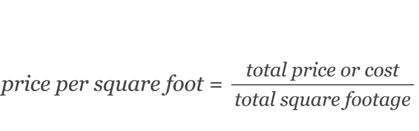

# Dictionary

This document defines terms used in this project.  
It helps readers unfamiliar with real estate or data engineering understand the context.

---

## APN
**Assessor’s Parcel Number**.  
A unique identifier assigned by local tax assessors to each parcel of land.  
- In listings, APNs may include dashes or formatting.  
- In climate data, APNs appear as digits only.  
- Our pipeline **normalizes APNs by stripping non-digit characters** so the two datasets can be joined.

| APN (raw)     | APN (normalized) |
|---------------|------------------|
| 123-456-789   | 123456789        |
|  22  334-4555 | 2233444555       |
| 55.6677.7888  | 5566777888       |

---

## Flood Zone
A geographic area designated by FEMA (Federal Emergency Management Agency) that has a certain level of flood risk.  
- Common zones: `AE` (high risk), `VE` (coastal flood risk), `X` (minimal risk).  
- Used in property risk assessment and insurance pricing.  
- If climate data is missing, we set this field to `null`.

---

## Price per Square Foot
A derived metric: 

---

## Status
Indicates the current sale status of a property listing.  
- **for_sale** → Property is actively listed.  
- **pending** → Sale is in progress.  
- **sold** → Sale has completed.  
- All other statuses (e.g., withdrawn, expired) are **discarded** in the pipeline.

---

## Full Address
A concatenated field used for display:  
`"{address}, {city}, {state} {zip}"`.  
- Makes data easier to read.  
- Every record has an identifier.

---
